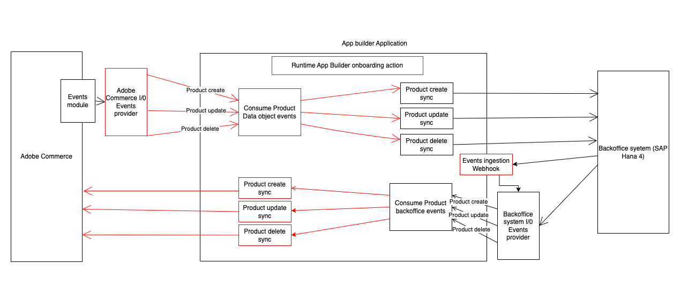

# Commerce Extensibility Starter Kit

Welcome to Adobe Commerce Extensibility Starter Kit 



## Pre requisites
Go to developer portal
- Create a new project from template
- Add the following API services
  - Adobe I/0 events
  - Adobe I/O management
- Download [workspace configuration json](https://developer.adobe.com/commerce/extensibility/events/project-setup/#download-the-workspace-configuration-file) file

- Git clone the project from the following repo https://git.corp.adobe.com/enterprise-integration/starter-kit
- Configure the env file `cp env.dist .env`, some of the environment variables you can get them from the 'workspace configuration json'

Install commerce eventing module in your commerce instance following this [documentation](https://developer.adobe.com/commerce/extensibility/events/installation/) 

## Setup

### Configure the project
Ensure to select the proper Organization > Project > Workspace with the following commands:
`aio console org select`
`aio console project select`
`aio console workspace select`

After that initiate the Application with the following command:
```bash
aio app use
```
Install dependencies using the command 
```bash
npm install
```
Define all the required parameters inside your `.env` file, in the `.env` file is auto explained from where to retrieve that information.

Edit the file app.config.yaml in case you want to deploy specific entities by des-commenting the entities you want to use:
```yaml
application:
  runtimeManifest:
    packages:
      product:
        license: Apache-2.0
        actions:
          $include: ./actions/product/product.actions.config.yaml
          #$include: ./actions/customer/customer.actions.config.yaml
          #$include: ./actions/stock/stock.actions.config.yaml
          #$include: ./actions/order/order.actions.config.yaml
          #$include: ./actions/shipment/shipment.actions.config.yaml
```
### Deploy 
Deploy the runtimes using command:
```bash
aio app deploy
```
### Setup eventing
Edit the onboading file in ./onboarding/custom/registrations.json to create the needed events information, the entities that you don't des-comment previously should stay empty.
In case you want to receive events from commerce add 'commerce' to the entity value, for backoffice updates add 'backoffice' as showing:
```json
{
  "product": ["commerce", "backoffice"],
  "customer": [],
  "order": [],
  "stock": [],
  "shipment": []
}
```

To start the process of creating the events providers and registrations run the command:
```bash
npm run onboard
```

the console will return the providers IDs, use this values to configure your commerce and application to send events to IO events.
```
Process of On-Boarding done successfully: [
  {
    key: 'commerce',
    id: 'THIS IS THE ID OF COMMERCE PROVIDER',
    label: 'Commerce Provider'
  },
  {
    key: 'backoffice',
    id: 'THIS IS THE ID OF BACKOFFICE PROVIDER',
    label: 'Backoffice Provider'
  }
]

```

### Configure commerce

#### Configure Adobe I/O Events
To configure the provider in commerce do the following:
- In the Commerce Admin, navigate to Stores > Settings > Configuration > Adobe Services > Adobe I/O Events > General configuration. The following screen displays.

- Select the server-to-server authorization method you implemented from the Adobe I/O Authorization Type menu. Adobe recommends using OAuth. JWT has been deprecated.
- Copy the contents of the <workspace-name>.json (Workspace configuration json) file into the Adobe I/O Workspace Configuration field.
- Copy the commerce provider instance ID returned in the command output of onboard into the Adobe Commerce Instance ID field.
- Copy the commerce provider ID returned in the command output of onboard into the Adobe I/O Event Provider ID field in the Admin.
- Click Save Config.
- Enable Commerce Eventing by setting Enabled to Yes. (Note: You must enable cron so that Commerce can send events to the endpoint.)
- Enter the merchant's company name in the Merchant ID field. You must use alphanumeric and underscores only.
- In the Environment ID field, enter a temporary name for your workspaces while you are in development mode. When you are ready for production, change this value to a permanent value, such as Production.
- (Optional) By default, if an error occurs when Adobe Commerce attempts to send an event to Adobe I/O, Commerce retries a maximum of seven times. To change this value, uncheck the Use system value checkbox and set a new value in the Maximum retries to send events field.
- (Optional) By default, Adobe Commerce runs a cron job (clean_event_data) every 24 hours that deletes event data that is three days old. To change the number of days to retain event data, uncheck the Use system value checkbox and set a new value in the Event retention time (in days) field.
- Click Save Config.

#### Configure an Integration
Configure a new Integration to secure the calls to Commerce from App Builder using OAuth by following these steps:
- In the Commerce Admin, navigate to System > Extension > Integrations.
- Click the `Add New Integration` button. The following screen displays
  
- Give the integration a name. The rest of the fields can be left blank.
- Grant access to all the resources.
- Click Save.


## Development
### Product entity
#### Commerce to third party
- [Product created in commerce](actions/product/commerce/created/README.md)