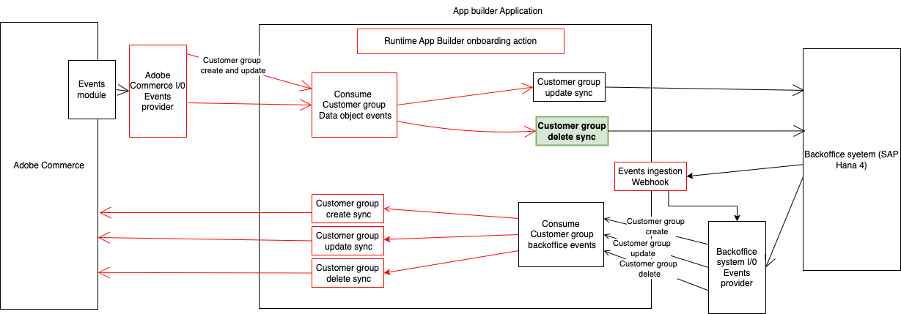

## Integrate Adobe Commerce customer group deleted event with a third party
This runtime action is responsible for notifying the integration with the 3rd party after a customer group is deleted in Adobe Commerce.



# Incoming information
The incoming depends on the fields specified during the event registration in Adobe Commerce. For more information, please check it here: https://developer.adobe.com/commerce/extensibility/events/configure-commerce/#subscribe-and-register-events
Here is JSON sample information:
```json
{
  "customer_group_id": 6,
  "customer_group_code": "Group name code",
  "tax_class_id": 4,
  "tax_class_name": "Tax class name",
  "extension_attributes": {
    "exclude_website_ids":[]
  }
}
```
There is other interesting information that you can access in params, like the event code triggered by Commerce and event ID.

## Payload transformation
Please proceed with any data transformation required for the information required format in the 3rd party in the extension module.
That transformation is defined in the `transformData` function in the `transformer.js` file.

## Connect with the 3rd party
The connection with the third party is defined in the `sendData` function in the `sender.js` file.
Please include all the authentication and connection login on that `sender.js` file or an extracted file outside index.js.
Any need for parameters from the environment could be accessed from `params`. Add the needed parameter in the `actions/customer/commerce/actions.config.yaml` under `group-deleted -> inputs` as follows:
```yaml
group-deleted:
  function: commerce/deleted/index.js
  web: 'no'
  runtime: nodejs:16
  inputs:
    LOG_LEVEL: debug
    HERE_YOUR_PARAM: $HERE_YOUR_PARAM_ENV
  annotations:
    require-adobe-auth: true
    final: true
```

# Response expected
That runtime action must respond 500 in case of error with the 3rd party integration.
```javascript
return {
    statusCode: 500,
    error: 'error message'
}

```
If everything is fine, return 200 to mark the event completed in Adobe I/O and close the loop.
```javascript
return {
    statusCode: 200
}
```
