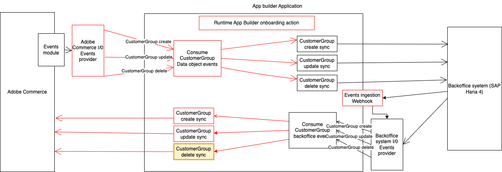

# Integrate a third-party customer group deleted event with Adobe Commerce.
This runtime action is responsible for notifying the integration with Adobe Commerce after a customer is deleted by the 3rd party.



# Incoming information
The incoming data depends on the third-party API and entity model.
Here is a JSON sample:
```json
{
  "id": 8
}
```

# Data validation
The incoming data is validated against a JSON schema defined in the `schema.json` file.
Here's an example:
```json
{
  "type": "object",
  "properties": {
    "id": { "type": "number" }
  },
  "required": ["sku"],
  "additionalProperties": false
}

```

## Payload transformation
Please proceed with any data transformation needed to adapt the incoming message to the Adobe Commerce API payload.
That transformation is defined in the `transformData` function in the `transformer.js` file.

## Preprocess data
Any preprocessing needed before calling the Adobe Commerce API can be implemented in the `preProcess` function in the `pre.js` file.

## Interact with the Adobe Commerce API
The interaction with the Adobe Commerce API is defined in the `sendData` function in the `sender.js` file.
This function delegates to the `deleteCustomerGroup` method in the `actions/customer/commerceCustomerGroupApiClient.js` interaction with the Commerce API.
Any parameters needed from the execution environment could be accessed from `params`.
These parameters can be passed on the action by configuring them in the  `actions/customer/external/actions.config.yaml` under `group-deleted -> inputs` as follows:
```yaml
group-deleted:
  function: deleted/index.js
  web: 'no'
  runtime: nodejs:16
  inputs:
    LOG_LEVEL: debug
    COMMERCE_BASE_URL: $COMMERCE_BASE_URL
    COMMERCE_CONSUMER_KEY: $COMMERCE_CONSUMER_KEY
    COMMERCE_CONSUMER_SECRET: $COMMERCE_CONSUMER_SECRET
    COMMERCE_ACCESS_TOKEN: $COMMERCE_ACCESS_TOKEN
    COMMERCE_ACCESS_TOKEN_SECRET: $COMMERCE_ACCESS_TOKEN_SECRET
  annotations:
    require-adobe-auth: true
    final: true
```

## Postprocess data
Any postprocessing needed after calling the Adobe Commerce API can be implemented in the `postProcess` function in the `post.js` file.

# Response expected
The runtime action must respond with 400 if the validation fails. It will prevent the message processing from being retried by Adobe I/O.
```javascript
return {
    statusCode: 400,
    error: errors
}
```

The runtime action must respond with 500 in case of an unexpected error while processing the request.
```javascript
return {
    statusCode: 500,
    error: 'error message'
}
```

If everything is fine, return 200 to mark the event completed in Adobe I/O and close the loop.
```javascript
return {
    statusCode: 200
}
```
