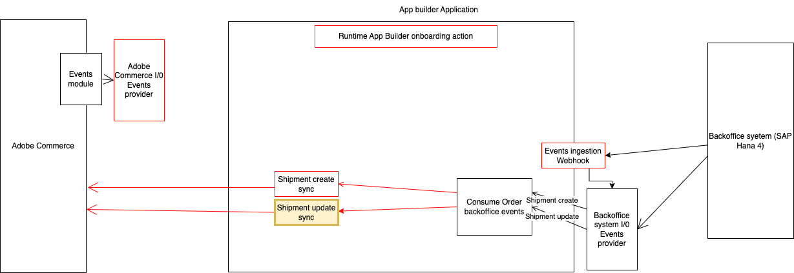

# Integrate a third-party shipment updated event with Adobe Commerce.
This runtime action is responsible for notifying the integration with Adobe Commerce after a shipment is updated in the 3rd party.



# Incoming event payload
The incoming event payload depends on the third party API and entity model.
Here is a payload example of the data received in the event:
```json
{
  "id": 32,
  "orderId": 7,
  "items": [
    {
      "entityId": 18,
      "orderItemId": 7,
      "qty": 1
    }
  ],
  "tracks": [
    {
      "entityId": 18,
      "trackNumber": "Custom Value",
      "title": "Custom Title",
      "carrierCode": "custom"
    }
  ],
  "comments": [
    {
      "entityId": 18,
      "notifyCustomer": false,
      "comment": "Order Shipped from API",
      "visibleOnFront": true
    }
  ],
  "stockSourceCode": "default"
}
```

# Data validation
The incoming data is validated against a JSON schema defined in the `schema.json` file.
Here's an example:
```json
{
  "type": "object",
  "properties": {
    "id": { "type":  "number" },
    "orderId": { "type":  "number" },
    "items": {
      "type": "array",
      "items": {
        "type": "object",
        "properties": {
          "entityId": { "type":  "number" },
          "orderItemId": { "type":  "number" },
          "qty": { "type":  "number" }
        },
        "required": ["entityId", "orderItemId", "qty"],
        "additionalProperties": false
      }
    },
    "tracks": {
      "type": "array",
      "items": {
        "type": "object",
        "properties": {
          "entityId": { "type":  "number" },
          "trackNumber": { "type":  "string" },
          "title": { "type":  "string" },
          "carrierCode": { "type":  "string" }
        },
        "required": ["entityId", "trackNumber", "title", "carrierCode"],
        "additionalProperties": false
      }
    },
    "comments" : {
      "type": "array",
      "items": {
        "type": "object",
        "properties": {
          "entityId": { "type":  "number" },
          "notifyCustomer": { "type":  "boolean" },
          "comment": { "type":  "string" },
          "visibleOnFront": { "type":  "boolean" }
        },
        "required": ["entityId", "notifyCustomer", "comment", "visibleOnFront"],
        "additionalProperties": false
      }
    },
    "stockSourceCode": { "type":  "string" }
  },
  "required": ["id", "orderId", "items", "tracks", "comments", "stockSourceCode"],
  "additionalProperties": false
}
```

## Interact with the Adobe Commerce API
The `sendData` function in the `sender.js` file defines the interaction with the Adobe Commerce API.
This function delegates to the `updateShipment` method in the `actions/order/commerceShipmentApiClient.js` interaction with the Commerce API.
Any parameters needed from the execution environment could be accessed from `params`.
These parameters can be passed on the action by configuring them in the  `actions/order/external/actions.config.yaml` under `shipment-updated -> inputs` as follows:
```yaml
shipment-updated:
  function: updated/index.js
  web: 'no'
  runtime: nodejs:16
  inputs:
    LOG_LEVEL: debug
    COMMERCE_BASE_URL: $COMMERCE_BASE_URL
    COMMERCE_CONSUMER_KEY: $COMMERCE_CONSUMER_KEY
    COMMERCE_CONSUMER_SECRET: $COMMERCE_CONSUMER_SECRET
    COMMERCE_ACCESS_TOKEN: $COMMERCE_ACCESS_TOKEN
    COMMERCE_ACCESS_TOKEN_SECRET: $COMMERCE_ACCESS_TOKEN_SECRET
  annotations:
    require-adobe-auth: true
    final: true
```
