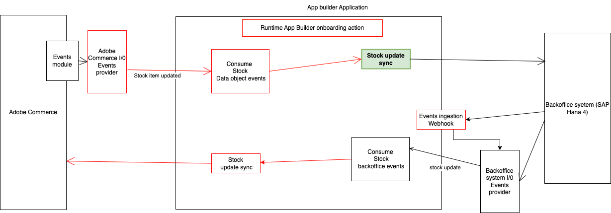

## Integrate Adobe Commerce stock item updated event with a third party
This runtime action is responsible for notifying the integration with the 3rd party after a stock item is updated in Adobe Commerce.



# Incoming information
The incoming depends on the fields specified during the event registration in Adobe Commerce. For more information, please check it here: https://developer.adobe.com/commerce/extensibility/events/configure-commerce/#subscribe-and-register-events
Here is JSON sample information:
```json
{
  "item_id":"1",
  "product_id":"1",
  "stock_id":1,
  "qty":"1",
  "min_qty":"0",
  "is_qty_decimal":"0",
  "max_sale_qty":"10000",
  "is_in_stock":"1",
  "website_id":0,
  "type_id":"simple"
}
```
There is other interesting information that you can access in params like the event Code trigger by Commerce, event id.

## Payload transformation
Please proceed with any data transformation required for information required format in the 3rd party in the extension module.
That transformation is defined in the `transformData` function in the `transformer.js` file.

## Preprocess data
Any preprocessing needed before calling the external backoffice application API can be implemented in the `preProcess` function in the `pre.js` file.

## Connect with the 3rd party
The connection with the third party is defined in the `sendData` function in the `sender.js` file.
Please include all the authentication and connection login on that `sender.js` file or an extracted file outside index.js.
Any need for parameters from environment could be access from `params`. Add the needed parameter in the `actions/stock/commerce/actions.config.yaml` under `updated -> inputs` as follows:
```yaml
updated:
  function: commerce/updated/index.js
  web: 'no'
  runtime: nodejs:16
  inputs:
    LOG_LEVEL: debug
    HERE_YOUR_PARAM: $HERE_YOUR_PARAM_ENV
  annotations:
    require-adobe-auth: true
    final: true
```

## Postprocess data
Any postprocessing needed after calling the external backoffice application API can be implemented in the `postProcess` function in the `post.js` file.

# Response expected
That runtime action must respond 500 in case of error with the 3rd party integration. Please send an array of errors for the Consumer is able to log it and the retry mechanism is triggered.
```javascript
return {
    statusCode: 500,
    error: errors
}

```
In case tha everything is fine, return 200 to mark the event completed in Adobe I/O and close the loop.
```javascript
return {
    statusCode: 200
}
```
